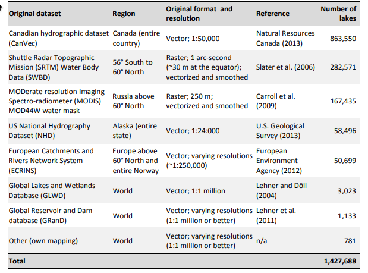

# Waterbodies Attributes

## Global Lake/Reservoir Surface Extent Dataset (GLRSED)

Paper: https://doi.org/10.1002/gdj3.285

Data: https://zenodo.org/records/14190225

The Global Lake/Reservoir Surface Extent Dataset (GLRSED) contains the spatial extent and basic attributes (e.g., name, area, lake type and source) of 2.17 million lakes/reservoirs and was produced based on HydroLAKES, GRanD and OpenStreetMap. The dataset contains 1423875 lakes and 747268 reservoirs.

Data Sources:

- HydroLAKES
- OpenStreetMap
- Global Reservoir and Dam Database (GRanD) v1.1
- Auxiliary Data:
    1. Global Reservoir and Dam Database (GRanD) v1.1
    2. GeOreferenced Database of Dams (GOODD)
    3. Georeferenced global Dams And Reservoirs (GeoDAR) database

### GLRSED Results

There are 84,059 waterbodies in the GLRSED dataset for Africa.
71,321 of these waterbodies are reservoirs (artificial waterbodies).
112 of these waterbodies have names.

Using a simple intersection with the DE Africa waterbodies dataset (700,712 waterbodies):

- 24,179 DE Africa waterbodies have been identified as reservoirs (artificial waterbodies).
- 6,850 DE Africa waterbodies have been assigned a name
- 3 out of the 6,850 DE Africa waterbodies that have been assigned a name have 2 or more names due to intersection with multiple named GLRSED waterbodies.

## HydroATLAS LakeATLAS

Technical Documentation: https://data.hydrosheds.org/file/technical-documentation/HydroATLAS_TechDoc_v10_1.pdf

Full Description of available attributes: https://data.hydrosheds.org/file/technical-documentation/LakeATLAS_Catalog_v10.pdf

Paper: https://doi.org/10.1038/s41597-022-01425-z

License: Creative Commons Attribution (CC-BY) 4.0 International License.

The HydroATLAS LakeATLAS dataset offers a global compendium of hydro-environmental characteristics for all lake polygons of HydroLAKES. HydroLAKES aims to provide the shoreline polygons of all global lakes with a surface area of at least 10 ha.

Datasets used in the creation of HydroLakes:

### LakeATLAS Results

There are 15,950 waterbodies in the HydroAtlas LakeAtlas dataset for Africa.
715 of these waterbodies are reservoirs (artificial waterbodies).
112 of these waterbodies have names.

Using a simple intersection with the DE Africa waterbodies dataset (700,712 waterbodies):

- 1,246 DE Africa waterbodies have been identified as reservoirs (artificial waterbodies).
- 6,156 DE Africa waterbodies have been assigned a name
- 3 out of the 6,156 DE Africa waterbodies that have been assigned a name have 2 or more names due to intersection with multiple named LakeAtlas waterbodies.

## ReaLSAT

This is a global dataset of reservoir and lake surface area variations.

Data Access: https://zenodo.org/records/7614815

Paper: https://doi.org/10.1038/s41597-022-01449-5

Attibutes info: https://zenodo.org/records/5762433/files/1-ReaLSAT.html?download=1

### ReaLSAT Results

There are 34,311 waterbodies in the ReaLSAT dataset for Africa.
1942 of these waterbodies are reservoirs (artificial waterbodies).

Using a simple intersection with the DE Africa waterbodies dataset (700,712 waterbodies):

- 2250 DE Africa waterbodies have been identified as reservoirs (artificial waterbodies).

> This dataset does not have a Name Attribute

## Global Dam Watch

Data download: https://forms.gle/uGPPTELE8hEaNMhR7

Paper: https://doi.org/10.1038/s41597-024-03752-9

License:  CC BY license

This is a globally consistent dam and instream barrier data product for global-scale analyses.

Contains the following datasets:

- GlObal geOreferenced Database of Dams (GOODD) Version 1: a map of 38,660 dams visible in Google Earth imagery
- Global Reservoir and Dam Database (GRanD) maps the location and attribute data of 7,320 dams greater than 15m in height or with a reservoir of more than 0.1km3.
- Future Hydropower Reservoirs and Dams (FHReD) maps 3,700 dams that are
under construction or in advanced planning stages.

> **This dataset has been fully integrated into HydroLakes.**

## Additional Attributes

### Assigning a Country Attribute

### Volume and depth

Do we need volume and depth data? 

### Data storage location

s3://deafrica-waterbodies-dev/waterbodies/v0.0.3/waterbodies-attributes/
